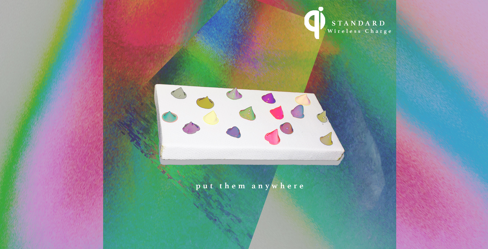

# Qi Standard

- Date: April 10, 2019
- Medium: Acrylic on canvas, Photography, Photoshop
- Title: Future Qi Promote
- Description: This is a promote on a future with Qi standard wireless charging.

The artwork outcome is a promote on a future with my topic, Qi standard wireless charging. The acrylic pigments are separated on the canvas in order to express the idea of "anywhere". The pigments represents the electronics that react with each other to create a wide coverage charging platform. I first put the acrylic pigments. then I took the picture, then I started to play with the curve tool i Photoshop.
In this future, the biggest point is it can be charged anywhere.
