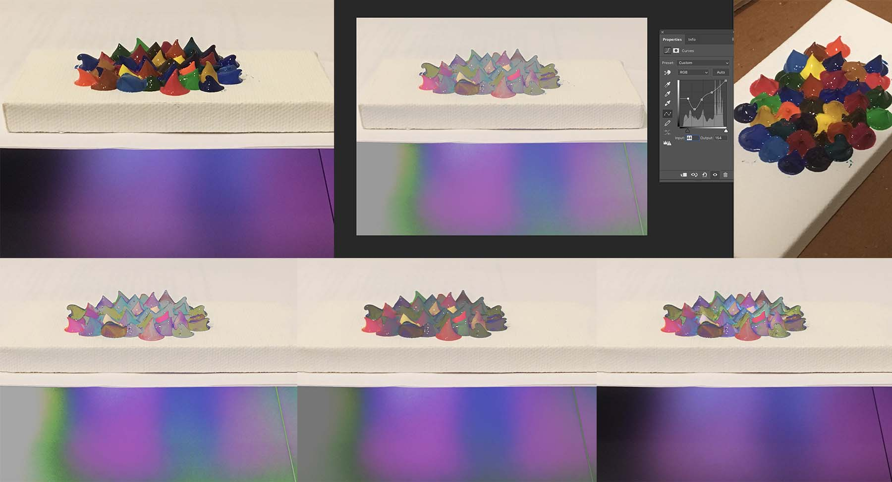

# Future Qi Promote, work in Progresss

- Title: Future Qi Promote
- Date of execution: 04/10/2019
- Medium: Acrylic on canvas, Photography, Photoshop
- Dimensions: height: 6.5”, width: 13”, 150ppi

- Date: April 03, 2019
- Medium: Acrylic on canvas, Photography, Photoshop with a 6.5”×13”, 150ppi digital canvas.
- Description: .

I first put the acrylic pigments next to each other and no restrict on color, next I took the picture, then I started to play with the curve tool i Photoshop, and I end up added a lot of curves in different area. I think the pigments themselves are not obvious enough, so I added some text and a logo of Qi standard.
 I put some acrylic pigments directly on the canvas and made them looks rugged in order to echo the text on the bottom which says "put them anywhere". This piece is basically a promote for the future Qi standard wireless charing. In this future, the biggest point is it can be charged anywhere, even on the rugged surface.
